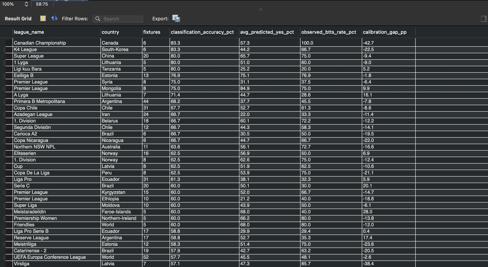
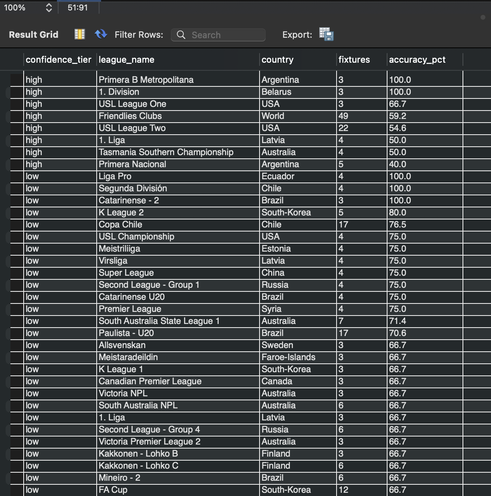
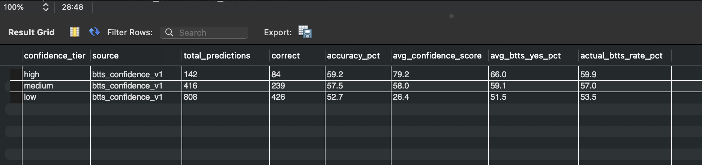
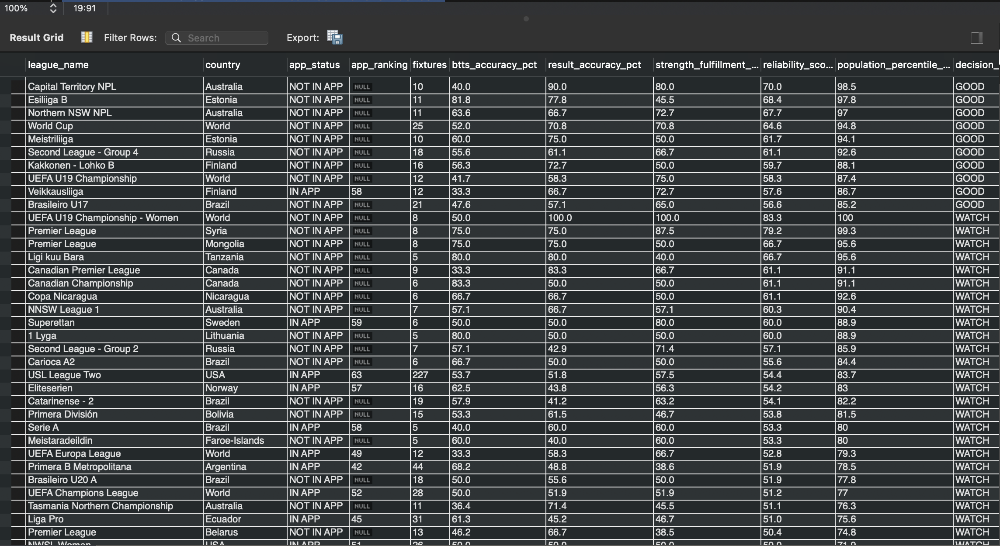
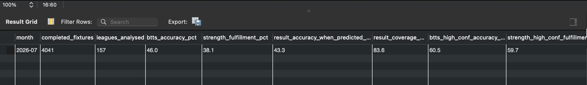

# ScoreSync Analytics

> A MySQL 8 analytics and model-monitoring project for evaluating football prediction accuracy, calibration, confidence reliability, league performance and model behaviour over time.

## Overview

ScoreSync Analytics is a SQL-based analytics project built to evaluate the prediction outputs produced by ScoreSync.

Rather than measuring model performance using a single headline accuracy percentage, the project examines whether predictions are:

- accurate;
- properly calibrated;
- supported by sufficient evidence;
- consistent with their stated confidence;
- reliable across different football leagues;
- improving or deteriorating over time; and
- behaving consistently across model versions.

The project evaluates three primary prediction signals:

- **BTTS** — Both Teams to Score
- **Team Strength** — whether the stronger-rated team wins
- **Match Result** — HOME / DRAW / AWAY

The repository demonstrates how raw prediction history can be transformed into a structured model-monitoring and decision-support framework using SQL.

---

## The Problem

A prediction model can appear successful while still hiding important weaknesses.

For example:

- a model may achieve reasonable overall accuracy while being badly calibrated;
- high-confidence predictions may not actually outperform medium-confidence predictions;
- some leagues may perform substantially better than others;
- a large sample of poor predictions should not automatically make a league "reliable";
- repeated tracking snapshots of the same fixture can artificially inflate sample sizes;
- model upgrades may improve one prediction signal while weakening another.

ScoreSync Analytics was designed to investigate these problems systematically.

The objective is therefore not simply:

> **"How often was the prediction correct?"**

but also:

> **"When should the prediction be trusted, where does it perform best, and does the confidence assigned by the model reflect what actually happens?"**

---

## Analytics Architecture

The analytical workflow is organised as a sequential SQL pipeline:

Raw prediction data
        │
        ▼
Import verification
        │
        ▼
Database & analytical schema
        │
        ▼
Canonical fixture-level evaluation
        │
        ├───────────────┬──────────────────┐
        ▼               ▼                  ▼
      BTTS        Team Strength       Match Result
        │               │                  │
        ▼               ▼                  ▼
   Accuracy        Accuracy           Accuracy
        │               │                  │
        ▼               ▼                  ▼
 Confidence       Confidence         Confidence
 Validation       Validation         Validation
        │               │                  │
        └───────────────┴──────────────────┘
                        │
                        ▼
               Model comparison
                        │
                        ▼
                Monthly reporting
                        │
                        ▼
           League calibration analysis
                        │
                        ▼
          Confidence fulfilment analysis
                        │
                        ▼
             League reliability model

## Repository Structure
ScoreSync-Analytics/
├── assets/
│   └── screenshots/
│       ├── btts-confidence-validation.png
│       ├── confidence-tier-league-accuracy.png
│       ├── league-btts-calibration.png
│       ├── league-reliability-decisions.png
│       └── monthly-model-performance.png
│
├── docs/
│   ├── analysis_flow.md
│   ├── data_dictionary.md
│   └── methodology.md
│
├── sql/
│   ├── 00_file_import_verifier.sql
│   ├── 01_create_database.sql
│   ├── 02_create_tables.sql
│   ├── 03_import_reference.sql
│   ├── 04_btts_accuracy.sql
│   ├── 05_btts_confidence_validation.sql
│   ├── 06_team_strength_accuracy.sql
│   ├── 07_team_strength_confidence_validation.sql
│   ├── 08_result_accuracy.sql
│   ├── 09_result_confidence_validation.sql
│   ├── 10_model_version_comparison.sql
│   ├── 11_monthly_model_report.sql
│   ├── 12_league_calibration_and_decisions.sql
│   ├── 13_confidence_fulfillment_analysis.sql
│   └── 14_league_reliability.sql
│
├── LICENSE
├── README.md
└── VALIDATION.txt

## Example Analysis Outputs

The following outputs demonstrate how the SQL analytics pipeline evaluates prediction accuracy, calibration, confidence reliability and league-level performance using completed fixture data.

### BTTS League Calibration

Compares the model's average predicted BTTS probability with the observed BTTS rate for each league. The calibration gap helps identify leagues where the model systematically over-predicts or under-predicts Both Teams to Score outcomes.

### Confidence-Tier League Accuracy

Breaks prediction performance down by confidence tier and league, making it possible to test whether higher-confidence predictions actually produce stronger observed accuracy across competitions.

### BTTS Confidence Validation

Tests whether the model's confidence hierarchy is meaningful by comparing high, medium and low confidence predictions against their realised accuracy and observed BTTS rates.

### League Reliability & Decision Support

Combines multiple performance measures into a league-level reliability framework. The output supports decisions about which competitions have sufficient evidence and predictive reliability to monitor, prioritise or treat cautiously.

### Monthly Model Performance

Provides a higher-level monitoring view of completed fixtures, leagues analysed, BTTS accuracy, team-strength fulfilment, result prediction performance and high-confidence performance over time.

> **Note:** These screenshots represent analytical outputs from the project dataset at a particular point in time. Results will change as additional completed fixtures are added to the dataset.
